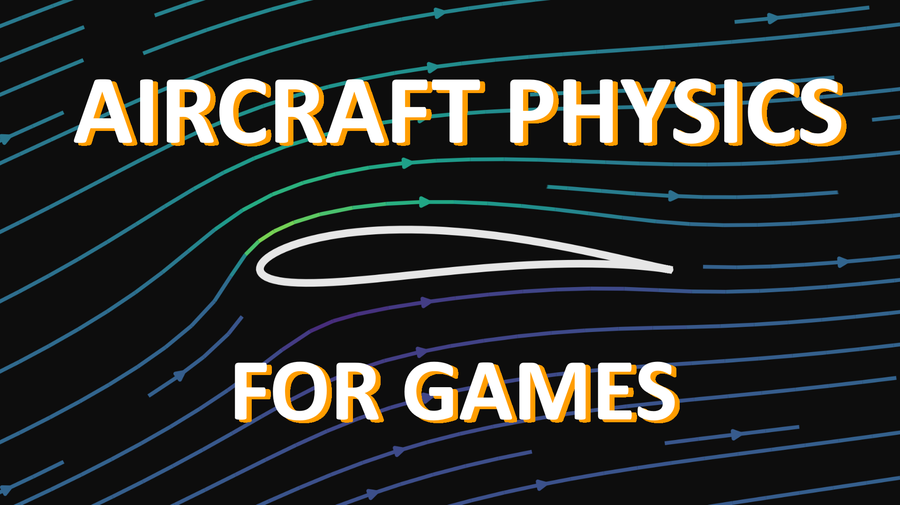
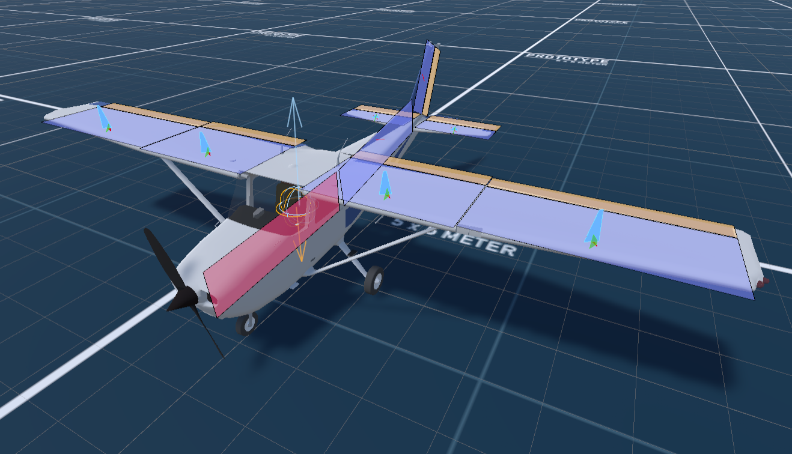
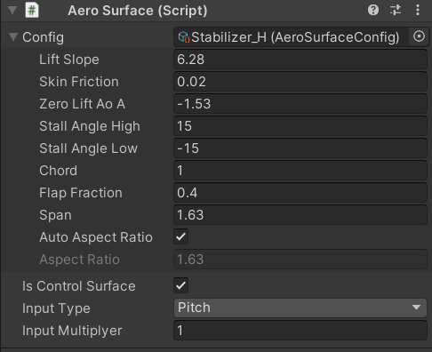
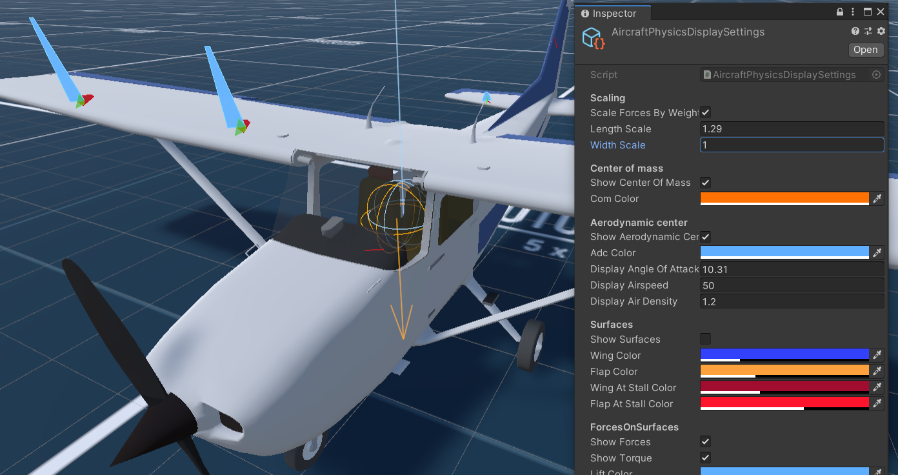

# Aircraft-Physics
Fixed wing aircraft physics for Unity. Based on paper by Khan and Nahon 2015.

**W. Khan and M. Nahon**, "Real-time modeling of agile fixed-wing UAV aerodynamics," 2015 *International Conference on Unmanned Aircraft Systems* (ICUAS), Denver, CO, 2015, pp. 1188-1195, doi: 10.1109/ICUAS.2015.7152411.

 [__Video__](https://youtu.be/p3jDJ9FtTyM) explaining the basics of how the system works.

 

## Getting started

To get started download the repo and open the project in Unity. Open the scene *Cessna-172* in the folder *Assets/Aircraft Physics/Example/Scenes*. In this scene I set up a simple plane. You can try to fly it by hitting play and using instructions on the screen. 

*Note that this is not a fully realistic Cessna-172. The equations in Khan and Nahon 2015 result in about a 1.5 times more drag than measured for real Cessna. This is probably the result of me using the model outside of its range of applicability. Because of this reason I had to multiply the thrust of the real plane by 1.5. The other significant difference is in the position of the center of mass. Unity doesn't allow to set density to individual colliders, so the COM is way off.*

## Components
Let's see what components do we have on the *Aircraft* game object. First of all, there is a `Rigidbody`. Note that it has it's Drag and Angular Drag fields set to zero. Unity's built-in drag will mess up the physics of the plane. Though you *can* have a little bit of angular drag for extra stability, you don't *need* it.

The second component is `AircraftPhysics`. It applies aerodynamic forces and thrust to the `Rigidbody`. It exposes a field for the thrust force in newtons and a list of `AeroSurface`s. This model computes the total force and torque acting on an airplane as a sum of impacts of separate parts, represented by the game objects with `AeroSurface` components. `AeroSurface` can be a wing, or a part of a wing, or a part of a tail etc. The rectangular gizmos represent all the `AeroSurface`s that constitute this aircraft. The child object of *Aircraft* called *Aerodynamics* contains as its children a number of `AeroSurface`s referenced in the list in `AircraftPhysics`. 

 

The last component is `AircraftController`. It interacts with the `AircraftPhysics` and `AeroSurface`s to apply control inputs to the plane. `AircraftPhysics` and `AeroSurface` are the core parts of the system and don't need to be changed most of the time. The `AircraftController` however is written as an example which you can expand upon.

The another important child of *Aircraft* called *Collision* has all the colliders which constitute the plane. For gears I use Unity's `WheelCollider`. It can be tricky to work with and quite unpredictable (though the same can probably be said about this system). You can change `WheelCollider` for something simpler and more robust. 

## AeroSurface

Let's take a look at the `AeroSurface`'s inspector. 

 

It has a reference to a `AeroSurfaceConfig`. It is a `ScriptableObject` that contains the aerodynamic parameters of the surface. 
| Parameter        | Description | 
| :------------- |:-------------|
| Lift Slope     | Slope angle of the lift coefficient in low angle of attack mode |
| Skin Friction  | Determines how much drag the surface creates due to friction (note, that drag is also created due to lift) |
| Zero Lift AoA | Angle of attack at which surface creates zero lift |
| Stall Angle High/Low | Angles of attack at which stall starts |
| Chord | Mean [chord](https://en.wikipedia.org/wiki/Chord_(aeronautics)) of the surface|
| Flap Fraction | How much of the surface is movable as a control surface. Shown by the gizmo as an orange region |
| Span | Length of the surface |
| Aspect Ratio | [Aspect Ratio](https://en.wikipedia.org/wiki/Aspect_ratio_(aeronautics)). Can be calculated from the chord and span automatically or set manually for the surfaces which are a part of a longer one. For example the wings are made of two parts stacked next to each other, so the flaps and ailerons could be controlled separately. In this case the aspect ratio for the parts should be set manually as an aspect ratio of the whole wing.|

Each `AeroSurface` with non zero Flap Fraction has a moving part, which deflection angle can be set by a SetFlapAngle method. Using them allows to implement [control surfaces](https://en.wikipedia.org/wiki/Flight_control_surfaces). `AirplaneController` has a list of `AeroSurface`s marked as control surfaces. It sets their deflection angles according to their input type. As an example there are Pitch, Yaw, Roll and Flap types. Input multiplier is needed for the surfaces to react to the input in opposite directions (like [ailerons](https://en.wikipedia.org/wiki/Aileron)).

## Editor tools

The important part of constructing an aircraft is to understand the balance of it. This system has some rudimentary editor tools for that. First of all, it shows positions of the center of mass (COM, orange wire sphere) and the aerodynamic center (ADC, blue wire sphere). The latter is defined as a point of application of aerodynamic forces. Secondly, it shows force of gravity and combined aerodynamic forces (arrows pointing from the centers COM and ADC spheres). Lastly, it shows lift, drag and torque acting on each surface as blue, red and green arrows. 

The scriptable object *AircraftPhysicsDisplaySettings* in the *Core/Config* folder allows to change the appearance of this gizmos. You can also choose angle of attack, airspeed and air density for which forces are calculated in Edit mode.

